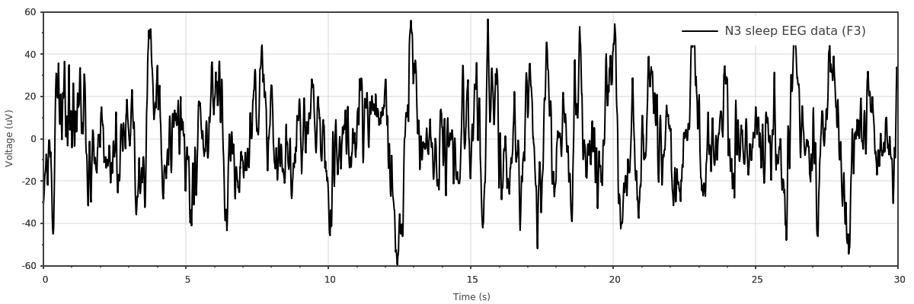
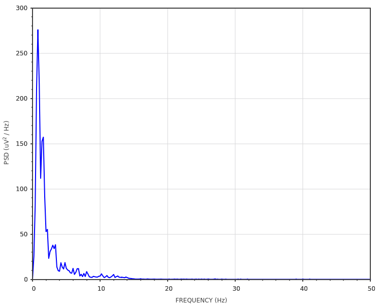

.. _examples_eeg:

EEG signal
=============================

This example is inspired from https://raphaelvallat.com/bandpower.html.

Here, we load EEG data, plot them and then compute its periodogram:
::
    #include <scicpp/core.hpp>
    #include <scicpp/plots.hpp>

    namespace sci = scicpp;
    namespace plt = sci::plots;
    namespace sig = sci::signal;

    int main() {
        using namespace sci::operators;
        using namespace sci::units::literals;

        // ---- Loading data (The signal is in microvolts)
        const auto eeg_signal = sci::TxtLoader<sci::units::microvolt<>>()
                                .skiprows(1)
                                .load_vector("examples/eeg-data.txt");

        // Sampling frequency and time vector
        constexpr auto fs = 100_Hz;
        const auto time = sci::arange(0.0, double(eeg_signal.size())) / fs;

        auto plot1 = plt::plot(time, eeg_signal);
        plot1.color("black");
        plot1.ylabel("Voltage (uV)");
        plot1.xlabel("Time (s)");
        plot1.fontSize(12);
        plot1.label("N3 sleep EEG data (F3)");
        plot1.show(1200, 400);

        // ---- Welch's periodogram
        // Configure the spectrum analyzer
        auto spec = sig::Spectrum{}
                    .fs(fs)
                    .window(sig::windows::Boxcar, time.size() / 6);

        auto plot2 = plt::psd<sig::DENSITY, plt::LINEAR>(spec, eeg_signal);
        plot2.size(1000, 500);
        plot2.xlabel("FREQUENCY (Hz)");
        plot2.ylabel("PSD (uV^2 / Hz)");
        plot2.show();
    }

The resulting plot of the signal:

The power spectral density in linear scale:

