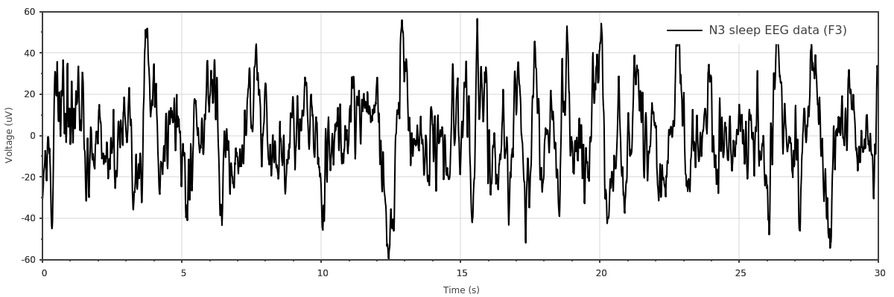

.. Scicpp documentation master file, created by
   sphinx-quickstart on Sat Dec  8 16:32:58 2018.
   You can adapt this file completely to your liking, but it should at least
   contain the root `toctree` directive.

.. raw:: html

    <embed>
        
    </embed>

SciCpp's documentation
==================================

SciCpp is a data and signal processing C++ library.

SciCpp objective is to follow the `SciPy <https://scipy.org/>`_ API while using standard C++
containers (``std::array`` and ``std::vector``) whenever possible.

SciCpp is a lightweight header only library.
Its only dependence is the `Eigen <http://eigen.tuxfamily.org/index.php?title=Main_Page>`_
linear algebra library, which is also header only.

SciCpp uses the C++-17 standard.
It is tested with the GCC and Clang compilers under Linux.

SciCpp is released under the MIT licence and `sources are available on Github <https://github.com/tvanderbruggen/SciCpp>`_.

Modules:
--------

.. toctree::
   :maxdepth: 2

   core.rst
   linalg.rst
   polynomial.rst
   signal.rst
   plots.rst

Introduction
--------

SciPy is an amazing library that facilitates developments.
Often SciPy is used for prototyping but algorithms must be re-implemented
in a system language for production.
This is especially the case for embedded systems, where the CPU and/or
memory resources may be too limited for the Python runtime.

SciCpp ambitions to facilitate the transition from
SciPy to C++ implementation. Therefore, SciCpp goal is
to mimic the SciPy API in terms of functions naming and behavior,
to avoid surprises in the transition process.

Examples
--------

:ref:`Wave statistics <examples_wave_stats>`

:ref:`EEG signal <examples_eeg>`

Plots
------

Even though Scicpp is not a plotting library,
some plotting functions are implemented based on the `Sciplot library <https://sciplot.github.io/>`_.

Those are not only useful for development and debugging but are also great examples of Scicpp library capabilities.

:ref:`EEG signal <examples_eeg>`

:ref:`Histogram <plots_hist>`

.. image:: _static/basic_hist.png
   :width: 600

:ref:`Boxplot <plots_boxplot>`

.. image:: _static/boxplot.png
   :width: 600

:ref:`Power spectrum <plots_csd_psd>`

.. image:: _static/psd.png
   :width: 600

:ref:`Window functions <examples_plot_windows>`

.. image:: _static/windows_fft.png
   :width: 600