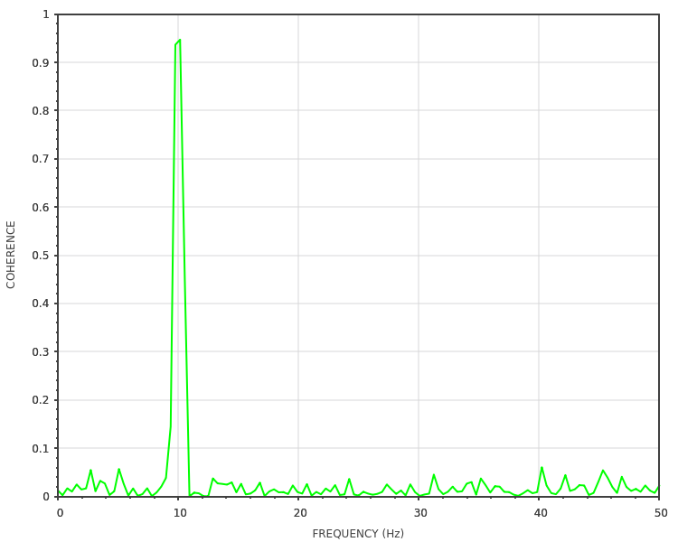

.. _plots_cohere:

scicpp::plots::cohere
====================================

Defined in header <scicpp/plots.hpp>

Plot the coherence between two signal.

Return a :expr:`sciplot::Plot2D` object.

--------------------------------------

.. function:: template <signal::SpectrumScaling scaling = signal::DENSITY, typename Array1, typename Array2, typename T = double> \
              auto cohere(signal::Spectrum<T> spec, const Array1 &x, const Array2 &y)

Plot the coherence between arrays :expr:`x` and :expr:`y`
using a given :ref:`Spectrum <signal_Spectrum>` analyzer :expr:`spec`.

--------------------------------------

Example
-------------------------

::

    #include <scicpp/core.hpp>
    #include <scicpp/plots.hpp>
    #include <scicpp/signal.hpp>

    namespace sci = scicpp;
    namespace plt = sci::plots;

    int main() {
        using namespace sci::operators;
        using namespace sci::units::literals;

        const auto N = 1E4;     // Number of samples
        const auto fs = 1E2_Hz; // Sampling frequency
        const auto f0 = 10_Hz;  // Signal frequency

        const auto t = sci::arange(0.0, N) / fs;

        // White noises
        const auto nse1 = sci::random::randn<double, 2813981405>(t.size());
        const auto nse2 = sci::random::randn<double, 4130028572>(t.size());

        // Angular frequency (1 turn = 2 pi radians)
        const auto omega0 = 1_turn * f0;
        const auto s1 = sci::sin(omega0 * t) + nse1;
        const auto s2 = sci::sin(omega0 * t) + nse2;

        // Configure the spectrum analyzer
        auto spec =
            sci::signal::Spectrum{}.fs(fs).window(sci::signal::windows::Hann, 256);

        auto plot = plt::cohere(spec, s1, s2);

        plot.size(1000, 500);
        plot.color("green");
        plot.xlabel("FREQUENCY (Hz)");
        plot.ylabel("COHERENCE");
        plot.show();
    }

See also
    ----------
    `Matplotlib documentation <https://matplotlib.org/stable/api/_as_gen/matplotlib.pyplot.cohere.html>`_
    
    `Matplotlib demo <https://matplotlib.org/stable/gallery/lines_bars_and_markers/cohere.html>`_
