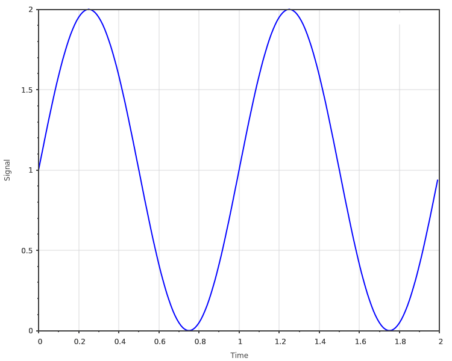

.. _plots_plot:

scicpp::plots::plot
====================================

Defined in header <scicpp/plots.hpp>

Basic plot.

Return a :expr:`sciplot::Plot2D` object.

--------------------------------------

.. function:: template <typename XArray, typename YArray> \
              auto plot(const XArray &x, const YArray &y)

Example
-------------------------

::

   #include <scicpp/core.hpp>
   #include <scicpp/plots.hpp>

   namespace sci = scicpp;
   namespace plt = sci::plots;

   int main() {
      using namespace sci::operators;
      using namespace sci::units::literals;

      const auto t = sci::arange(0.0, 2.0, 0.01);
      const auto s = 1.0 + sci::sin(2_rad * sci::pi<double> * t);

      auto plot = plt::plot(t, s);
      plot.xlabel("Time");
      plot.ylabel("Signal");
      plot.fontSize(12);
      plot.size(500, 500);
      plot.show();
   }

