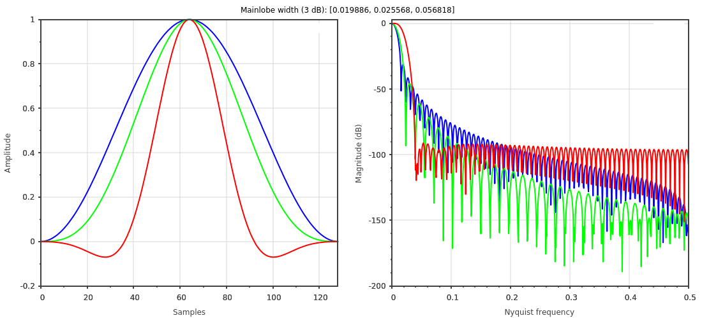

.. _plots_winvis:

scicpp::plots::winvis
====================================

Defined in header <scicpp/plots.hpp>

Window function plotting utility.

--------------------------------------

.. function:: template <std::size_t N = 128, typename... Windows> \
              void winvis(Windows... wins)

Example
-------------------------

::

   #include <scicpp/plots.hpp>
   #include <scicpp/signal.hpp>

   namespace plt = scicpp::plots;
   namespace win = scicpp::signal::windows;

   int main() {
      plt::winvis(win::Hann, win::Bohman, win::Flattop);
   }

